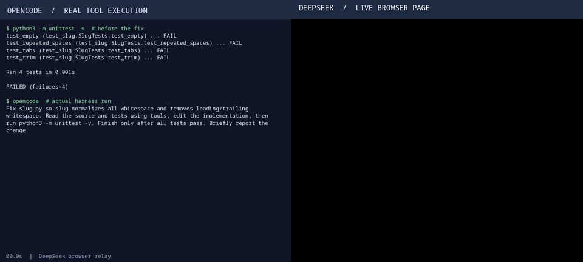

# Poor Man's DeepSeek API 👛

**Run Codewhale through the free DeepSeek Chat web UI instead of paying for the
API.** DeepChatCode is a local, OpenAI-compatible bridge: it starts a
loopback-only relay, drives a real Chromium session through Playwright, and
hands Codewhale a `deepseek-chat` model that answers from the chat page.
**Note: we need more contributions and testing to make this reliable at all, the current state is a mess, sub agent, attachments, only deepseek support, please, we humbly ask for your support, star us, fork the repo, open issues, PRs, spread it, open a discussion, we would really appreciate it!**
No API key. No per-token bill. Your own signed-in browser session does the work.

```
Codewhale (subprocess)
    ↓  OpenAI-compatible API, 127.0.0.1, random bearer token
DeepChatCode relay
    ↓  Playwright, incremental reads of the visible page
DeepSeek Chat (Chromium)
```

Codewhale still owns the turn loop, tools, permissions, approvals, and
workspace. DeepChatCode is only the transport.



*Recorded from a live run: the wrapper opened a fresh conversation, submitted the
prompt, and read the answer back as it streamed. Full clip:
[`assets/demo.mp4`](assets/demo.mp4).*

---

## Status

**Working, and verified against the live chat page** — not just
"compiles". Full detail in [STATUS.md](STATUS.md).

- `cargo test` — **64 passing**, 0 failing, plus thirteen live end-to-end tests
  that are ignored by default: `cargo test -- --ignored`.
- **A price is always answered**: `GET /v1/models` gives every model
  `"pricing": "Unlimited Chat!"`. One honest caveat, measured rather than
  guessed: *Codewhale's* footer says `cost: unknown (billing basis unknown)` for
  this route, and nothing the wrapper returns changes that — five shapes of
  catalog response were tried against real Codewhale, including a pricing string,
  per-million numbers and an OpenRouter-style object. Codewhale decides it from
  its own catalog. See [STATUS.md](STATUS.md).
- **The whole pipeline was run for real**: `deepchatcode -- exec "…"` launched
  `codewhale 0.10.0`, which answered through the local relay and the live chat
  page and printed `PONG`, exit 0.
- A live turn against `chat.deepseek.com`: first streamed chunk at **~0.9 s**,
  whole turn in **~1.4 s**.
- Tool calls verified live both ways: a declared catalog reaches the model
  (12 tools, 34 KB prompt) and can be suppressed (0 tools, 1.2 KB prompt), and a
  real `tool_calls` round trip returns a final answer.
- **Long conversations keep answering.** The chat page unmounts messages that
  scroll out of view, so counting assistant elements is not a truth about new
  replies — past a few exchanges the count stops growing while replies keep
  arriving, and the old count-based detection called the page silent. It reads
  the newest reply instead: verified live six prompts deep in one conversation
  (`W1`…`W6`, ~1.9 s each, the mounted count standing still on the last three).
- **Resume verified live**: a second browser opened on the linked conversation,
  recognised it, and answered a follow-up **in the same conversation**.
- Attach mode verified live against a Chromium the wrapper did not start.
- Incremental streaming, tool-call forwarding, session resume, model
  attribution, local OCR/vision, and desktop remote control are each verified
  with the evidence recorded in STATUS.md.

Known limits are listed honestly in [STATUS.md](STATUS.md) — the chat UI is not
an API contract, and model identity is what the page displays, not an API fact.

**The design is one decision:** Codewhale owns the loop and the tools, the chat
page owns the conversation, and this wrapper is only a model endpoint — messages
in, text out. Read [docs/design.md](docs/design.md) before changing anything about
what the wrapper does or does not do to a reply.

## What it can do

- **Own TUI** — a pre-flight lobby showing codewhale binary, version, relay, and
  browser health (`deepchatcode tui`).
- **Real browser, real session** — launches a dedicated Chromium profile, or
  attaches to a browser you already have open over CDP.
- **Headless or visible** — runs headless by default and reopens a visible
  window automatically when sign-in is needed.
- **Starts immediately** — Codewhale is launched while the browser is still warming,
  so the terminal is yours at once instead of after the page loads; the browser
  reports itself ready (`browser ready in Ns`) off the critical path. Navigation
  waits for the DOM rather than every image and beacon, which roughly halved the
  wait: **1.8-2.2 s** headless, 5.5 s visible.
- **Resume, don't restart** — maps each Codewhale session to its DeepSeek
  conversation and navigates back to it instead of re-feeding the transcript.
- **Survives the browser dying** — the page and its context are watched, so a
  closed or crashed browser is reopened **on the same conversation**: by a watcher
  while the bridge is idle, and by a one-shot retry if it happens mid-turn.
- **Incremental streaming** — reads the visible reply as it grows and emits
  OpenAI `delta` chunks; output appears as it is written, not all at once.
- **Tool calls both ways** — the tool catalog goes into the chat, tool calls come
  back as OpenAI `tool_calls`, and tool results go back in.
- **A log that says whose fault it was** — every turn is recorded, failures
  included, with a diagnosis that separates a dead DNS or uplink from a service
  that answered badly: `deepchatcode turns`.
- **Model attribution** — every turn is logged with the mode the page showed
  (for example `DeepThink=on, Search=on`), so a chat can be explained after the
  fact: `deepchatcode turns`.
- **Search, DeepThink, temperature, max tokens** — the page's own mode chips are
  read every turn and recorded (`DeepThink=on, Search=off`), and the **DeepThink
  control is driven**, not just read: asking the relay for `deepseek-pro`
  engages it, and the next `deepseek-chat` turn puts it back. Verified live — the
  chips read `off → on → on through a real turn → off`.
- **Two models** — `/v1/models` advertises `deepseek-chat` and `deepseek-pro`,
  both served by the same page; `--model deepseek-pro` launches Codewhale on the
  reasoning one. A pro turn that cannot engage DeepThink fails rather than
  answering as the plain model.
- **A price that is never "unknown"** — asked what a model costs, the wrapper
  answers `Unlimited Chat!`, always a non-empty string. What *Codewhale's own
  footer* prints is a separate matter; see the note under [Status](#status).
- **Two run modes** — `show` watches the work in a visible window; `silent` runs
  headless and quiet. Sign-in reopens a window in both.
- **Images and files** — uploaded through the visible browser's file input.
- **GUI or direct API** — drive the chat page, or POST to the site's own
  completion endpoint from inside the page so the session cookies apply.
- **Local vision and OCR** — `tools/vision.py` and `tools/ocr.py` run fully
  offline against a local model (and tesseract for exact OCR).
- **Remote desktop** — GNOME Remote Desktop set up and verified; see
  [docs/remote-desktop.md](docs/remote-desktop.md).

## Install

```bash
cargo install --git https://github.com/dixonSolutions/DeepChatCode
```

Not on crates.io yet, so this git install is the one that works today. Or from
source:

```bash
cargo build --release
cargo run                 # bare `cargo run` starts the bridge (default-run)
cargo run --release       # same, optimised
```

**There is no separate browser step.** On the first run the wrapper checks for
Playwright's Chromium, and if it is missing it fetches the build matching the
driver pinned in `Cargo.lock` and carries on — about 115 MB, once. The browser
lands in `~/.cache/ms-playwright` (or `$PLAYWRIGHT_BROWSERS_PATH`), which a
distrobox shares with the host, so it is usually already there.

If you would rather pay that download at build time — a Dockerfile or a CI image
— the same installer is a binary. It never needs a `playwright` CLI on `PATH`:

```bash
cargo run --bin install-deepseek-browser
cargo run --bin install-deepseek-browser -- --with-deps   # minimal image; uses sudo
```

### The browser installs itself

A first run on a fresh machine finds the driver (downloaded at build time by the
crate's own build script) but not the browser. Rather than stopping, the wrapper
fetches the matching Chromium and retries:

```
deepchatcode: Playwright's Chromium is not installed yet; fetching it now
              (one time, ~150 MB). Set PLAYWRIGHT_BROWSERS_PATH to put it elsewhere.
Chrome Headless Shell 153.0.8010.12 (playwright chromium-headless-shell v1243)
              downloaded to ~/.cache/ms-playwright/chromium_headless_shell-1243
… PONG
```

Driver and browser always match, because both come from the same crate version.

## Quickstart

1. **Install Codewhale** if it is not already there:

   ```bash
   deepchatcode install
   ```

2. **Run the bridge** (add `--` to pass anything through to Codewhale):

   ```bash
   deepchatcode
   ```

3. **Sign in** in the browser window if you are asked to. Then just use
   Codewhale — every completion is relayed through the chat page.

## Commands

| Command | What it does |
| --- | --- |
| `deepchatcode` | Run the bridge (default) |
| `deepchatcode tui` | Pre-flight TUI (health), then the bridge |
| `deepchatcode launch [BINARY]` | Find and remember the codewhale binary, then run |
| `deepchatcode health` | Check the codewhale binary, relay, browser, auth |
| `deepchatcode turns [--limit N]` | The recorded turn log: which model answered what |
| `deepchatcode install` | Install `codewhale-cli` via cargo |

Useful flags: `--mode show|silent`, `--model deepseek-chat|deepseek-pro`,
`--chat-url`, `--profile-dir`, `--cdp-endpoint`, `--record-video <DIR>`,
`--record-video-size WxH` (`--record-video` records the page the wrapper drives —
never your desktop).

`launch` does not skip setup: it discovers the codewhale executable (a bare name
is looked up on `PATH`, a path is used directly), writes the resolved path to
your user config, and then starts the bridge. A binary pinned with
`--codewhale-bin` / `$CODEWHALE_BINARY` is not rewritten into the config.

## Configuration

Two layers, merged lowest-precedence first:

- **Compiled-in defaults** — `assets/config.default.toml`, embedded in the
  binary with `include_str!`. Ships with the package; not read at runtime.
- **User config** — `~/.codewhale/deepchatcode/config.toml` (honors
  `$CODEWHALE_HOME`).

Resolution order for any value: **CLI flag → environment → user config →
compiled-in default**. So the codewhale path belongs in your user config
(`[codewhale] binary = …`), not in the repository.

### Bundle this in a mode

```toml
mode = "show"            # "show" = visible browser, prompts driven through the page
                        # "silent" = headless browser, prompts sent to the API directly
```

A mode is a **preset** over the two knobs below, applied under your own config:
`show` sets `[browser] headless = false` with `[transport] mode = "gui"`, and
`silent` sets `headless = true` with `transport.mode = "api"`. Setting either
knob yourself still wins — the one you leave alone follows the mode.

`silent` asks the site's own completion endpoint first, and that endpoint refuses
this project's requests (it wants a per-request proof-of-work header; see
[Checks](#checks) and `STATUS.md`). So when it refuses, the turn is retried
through the headless page and one line on stderr says so. The mode stays quiet
either way.

Sign-in is the one thing no mode suppresses: when the composer is not there, the
browser is reopened **visibly** in both modes so you can authenticate, and the run
continues afterwards. `--mode show|silent` overrides the config file.

### Browser

```toml
[browser]
mode = "managed"        # "managed" (own profile) or "attach" (your browser, over CDP)
headless = true         # false = always visible; true reopens a window if sign-in is needed
keep_alive = true       # false = close the browser after every turn
# profile_dir = "/home/you/.codewhale/deepseek-chat/browser"
# cdp_endpoint = "http://127.0.0.1:9222"
# record_video_dir = "/home/you/.codewhale/deepseek-chat/video"
# record_video_size = "1280x800"
```

`attach` reuses a browser you started yourself
(`chromium --remote-debugging-port=9222`) — the same signed-in session, no
separate profile. Passing `--cdp-endpoint` (or setting `cdp_endpoint`) implies
attach; you do not also need `mode = "attach"`. In `managed` mode the wrapper
refuses to fight another Chromium for the profile and says so in one line
instead of dumping a stack trace.

### Transport

```toml
[transport]
mode = "gui"            # "gui" drives the chat page; "api" POSTs from inside it

[transport.api]
# Private endpoint, driven from the page context so session cookies apply.
url = "/api/v0/chat/completion"
# Placeholders: {messages} {tools} {payload} {prompt} {thinking}.
# {thinking} is the reasoning flag a deepseek-pro turn needs — DeepSeek's own
# body calls it "thinking_enabled". A body without it cannot be told which model
# to use, so a pro turn over this transport is refused rather than answered by
# the plain model, and the turn falls back to the page instead.
body = "{\"messages\":{messages},\"stream\":true}"
framing = "sse"         # sse | json | text
text_path = "content"   # dot path into each response object
```

`api` mode is **not usable against DeepSeek**, and that is a measured finding
rather than an untested path. Reading the page's own traffic
(`cargo test -- --ignored live_discover_api_endpoint`) shows the endpoint is
`POST /api/v0/chat/completion` with the site's own body shape — and that every
request must carry, besides the bearer token, a per-request proof-of-work header
(`x-ds-pow-response`, from `/api/v0/chat/create_pow_challenge`) plus two
fingerprint headers. Without the token the server answers
`{"code":40003,"msg":"INVALID_TOKEN"}`; with it, `{"code":40300,
"msg":"MISSING_HEADER"}`. The page solves that challenge itself, which is
exactly what `gui` mode drives, so synthesizing it here is deliberately out of
scope. The mechanism is kept, complete and configurable, for endpoints that need
no such header.

### Selectors, timeouts, tools

The selectors are configuration because the chat UI can change:

```toml
[selectors]
composer = "textarea, [contenteditable='true'][role='textbox'], [contenteditable='true']"
assistant = ".ds-markdown, [data-message-role='assistant'], [data-role='assistant']"
send = "button[type='submit'], button[aria-label*='send' i], [data-testid*='send']"
search_toggle = "div.ds-toggle-button:has-text('Search')"
thinking_toggle = "div.ds-toggle-button:has-text('DeepThink')"
model_label = "div.ds-toggle-button"   # what `deepchatcode turns` records
```

The two toggles and the model label were read off the live page, not guessed.

Timeouts are knobs too, and they matter: `poll_ms` (how often the page is
re-read) and `settle_polls` (how many identical reads mean "the reply stopped
growing") are what took the first turn from tens of seconds to about one. They
are not, however, how a long conversation is kept alive: a reply is spotted by
the newest message *changing*, so a conversation that has outgrown the page's
mounted window does not need a longer `response_secs`, only a correct read.

`settle_polls` is a **quiet window, not a completion check**, and it is the one
knob that trades latency against a truncated reply. The page renders in bursts
(measured: gaps of ~165 ms between deltas), so a window smaller than the longest
pause ends the turn mid-sentence — which is how a 992-character answer once came
back as 208 characters ending in the middle of a word. The shipped default is
~3 s, which costs a few seconds between the last word and the end of the turn;
lower it if you would rather have the speed and can afford the risk.

```toml
[timeouts]
login_wait_secs = 900
login_probe_secs = 20      # headless sign-in probe before reopening a visible window
response_secs = 300
poll_ms = 150
settle_polls = 3
action_secs = 20
navigation_secs = 20
link_probe_secs = 10
```

Tool forwarding is configurable by name — never hardcoded:

```toml
[tools]
forward_all = true                    # false: send only `essential` + `search`
essential = []                        # e.g. ["read", "edit", "write", "bash"]
search = ["tool_search"]
allow_extra = []                      # accept a tool call the request never declared
```

### Browser lifecycle

DeepChatCode watches the page and its browser context for closure and crashes, so
it can tell *"the browser is gone"* from *"the page is slow"* without waiting out
a timeout. Two things then recover it:

- **While idle**, a watcher (`[browser] liveness_check_secs`, default 15 s) checks
  the browser and reopens it if it has gone, so a browser that is closed or
  crashes comes back **by itself**, on the conversation in progress. Set it to `0`
  to turn the check off; it is skipped when `keep_alive = false`, where an absent
  browser is the point.
- **Mid-turn**, a turn that fails because the browser vanished is retried once
  against a freshly opened browser.

```
[idle] first reply="ONE"
[idle] conversation=https://chat.deepseek.com/a/chat/s/b60f366c-…
[idle] pkill status=exit status: 0
 deepchatcode: the browser is gone; reopening it on the conversation and carrying on
 deepchatcode: the browser is back
[idle] the browser came back by itself on …/a/chat/s/b60f366c-…
```

That is a real `SIGKILL` of the browser process, with **no turn sent in between**
— the browser returned on its own, to the same conversation. Both paths are
covered by live tests that run against a *copy* of the profile, so they never
compete with a session you have open.

Retries back off (up to 5 minutes), so a machine with no network does not spin,
and a non-browser failure — a refusal from the model, say — is reported rather
than retried.

If the whole wrapper is restarted, the conversation is still found: the
session→conversation link lives in `~/.codewhale/deepchatcode/sessions.db`.

### The instruction text

The text sent ahead of every request is not hardcoded. It lives in
`assets/system-prompt.md`, committed and embedded, and you can point at your own
file instead:

```toml
[codewhale]
system_prompt = "/home/you/.config/deepchatcode/system-prompt.md"
```

`{project_dir}` and `{payload}` are filled at runtime. If your file has no
`{payload}`, the request is appended after it.

Codewhale's own system message — the whole project briefing — is forwarded into
the chat by default, because that briefing is the model's context: the workspace,
the project rules, the tools. The file above is only the transport contract (reply
with prose, or with a tool-calls object). Set `[relay] forward_system_prompt =
false` to drop the briefing and send a smaller prompt.

## Session linking and the turn log

The wrapper keeps an owner-only SQLite database at
`~/.codewhale/deepchatcode/sessions.db` with two tables.

**`chat_links`** maps a Codewhale session id to the DeepSeek Chat conversation it
relays through:

- A **new** Codewhale session opens the bare chat URL — a fresh conversation.
- The first reply's conversation URL is recorded against that session id.
- A **continued** session (`-c`, `-r <id>`, `--session-id <id>`, or the default
  auto-resume) navigates back to the linked conversation instead of starting
  over. The wrapper verifies the conversation is still reachable and realigns
  from scratch if it is not.
- `deepchatcode -- --fresh` starts a new conversation and a new link.

**`chat_turns`** logs one row per turn — *including the ones that failed*:

```
$ deepchatcode turns
2026-10-08T04:02:15Z  model=unknown             FAILED (dns, blame=network)  session=-  chat=-
2026-10-08T03:36:50Z  model=DeepThink=off, …   ok tools=yes chars=0         session=06e87ecd-…  chat=…/a/chat/s/49a41ff7-…
2026-10-08T03:36:39Z  model=DeepThink=off, …   ok tools=no  chars=225       session=06e87ecd-…  chat=…/a/chat/s/49a41ff7-…
```

Each row carries the session (or `-` when there is none), the conversation, the
model the page showed, whether tools were used, the answer size — and, for a
failure, what went wrong and **whose fault it was**:

- `blame=network` — DNS did not resolve, or nothing accepted a connection, or
  Chromium reported an `ERR_INTERNET_*`/`ERR_CONNECTION_*` code. **Not DeepSeek.**
- `blame=service` — the endpoint actually answered, with an HTTP status (a
  "healthy" 404 is a verdict). Only then is it theirs.
- `blame=wrapper` — a refused request, a bad tool call, or a browser that died.
- `blame=unknown` — the page stayed silent while the host was demonstrably
  reachable. That is *not* blamed on the service, because no status was seen.

The table is created and **migrated** on open, so a database written by an
earlier build gains the failure columns instead of silently losing them.

## Local vision and OCR

Beyond the bridge, this repo carries the local tooling it was built with:

```bash
python3 tools/vision.py --prompt "Describe this UI." screenshot.png
python3 tools/ocr.py invoice.png                 # tesseract, falls back to the model
python3 tools/ocr.py invoice.png --backend ollama
```

Both run offline against a local model (verified here with `gemma4:26b` through
Ollama) and `tools/ocr.py` prefers `tesseract` for exact transcription. See
[tools/README.md](tools/README.md).

## Security

- The relay binds `127.0.0.1` on an ephemeral port with a random `cw_…` bearer
  token; there are no CORS headers, so browser scripts cannot read it
  cross-origin.
- Credentials and cookies stay in the Chromium profile. The wrapper never reads
  them and never calls a private endpoint unless you set `[transport] mode = "api"`.
- The session-link database and the audit log are created owner-only (0700 dir,
  0600 files). Audit records go to `~/.codewhale/deepseek-chat/audit/`.
- `--record-video` records the page the wrapper drives, not your desktop.

**Remote desktop, if you enable it**, is separately documented and separately
risky: GNOME Remote Desktop binds every interface and the default firewall zone
on this machine already permits the port. Read
[docs/remote-desktop.md](docs/remote-desktop.md) before turning it on.

## Checks

```bash
cargo test --locked
cargo clippy --locked --all-targets
```

The suite covers the relay protocol, CORS and auth behavior, incremental
streaming deltas, tool-call normalization, session-link and turn-log storage,
config precedence, and a real Playwright round trip against a local mock chat
page. The live test — `cargo test -- --ignored` — drives the actual DeepSeek
Chat page and needs a signed-in profile.

## License

MIT
